# Memoria de la práctica 3

## Subsistemas realizados por cada componente

José Antonio Álvarez Ocete - Subsistema de jugadores

Laura Gómez - Subsistema de personajes

Miguel Lentisco Ballesteros - Subsistema de universos y partidas

## Diferencias respecto a la anterior entrega

  - Corregida errata del diagrama Entidad Relación de la práctica 2: Cambiado
  identificador en la tabla Jugador por DNI.

  - Añadida restricción semántica RS1.7 para que el correo sea único (no haya
  dos jugadores con el mismo), y por tanto sea luego clave candidata.

  - Añadida restricción semántica RS3.2 para que el nombre del universo sea único.

## Descripción del problema

Queremos diseñar un sistema de información para manejar la información de un
club de juegos de rol. Almacenaremos datos de:
- Los jugadores.
- Los personajes que manejan dichos jugadores.
- Los universos donde viven estos personajes.
- Las distintas partidas pertenecientes a un universo.

Estudiaremos de forma relativamente independiente tres subsistemas:
- Los jugadores.
- Los personajes.
- Los universos y las partidas.

Requeriremos las siguientes funcionalidades:
- Para el subsistema de jugadores:
  - Añadir un nuevo jugador.
  - Consultar la información de un jugador.
  - Consultar un listado de jugadores.
  - Consultar las partidas de un jugador.
  - Consultar los personajes de un jugador.

- Para el subsistema de personajes:
  - Añadir un personaje.
  - Actualizar un personaje.
  - Consultar la información del personaje.
  - Consultar las partidas de un personaje.
  - Eliminar a un personaje.

- Para el subsistema de universos y partidas:
  - Añadir un nuevo universo.
  - Crear una nueva partida.
  - Consultar listado de partidas.
  - Consultar listado de universos.
  - Consultar los datos de una partida.
  - Consultar listado de las partida de un universo.

Almacenamos la siguiente información:

- **Jugador**:
  - Alias
  - DNI
  - Correo
  - Lista de personajes
  - Lista de partidas en que participa.

- **Personaje**:
  - Identificador
  - Nombre.
  - Estado
  - Atributos de estado.
  - Universo al que pertenece
  - Lista de partidas en las que participa.

Nota: el personaje recibe una lista a completar de atributos por parte del universo.

- **Universo**:
  - Nombre
  - Género(s)
  - Lista de personajes
  - Lista de partidas del universo
  - Reglas del universo

- **Partida**:
  - Identificador
  - Nombre
  - Log de fechas
  - Lista de personajes que participan
  - Universo en el que se desarrolla

## Requisitos funcionales
### Para el subsistema de jugadores:
  - **RF1.1** (E: **RD1.1**, M: **RD1.2**, S: **RD1.3**) Añadir un nuevo jugador: esta función registra un nuevo jugador en el sistema a traves de los datos del mismo proporcionados por el administrador.
  - **RF1.2** (E: **RD1.4**, M: **RD1.5**, S: **RD1.6**) Consultar la información de un jugador: esta función muestra la información del jugador asociado al DNI y Alias recibido por el administrador.
  - **RF1.3** (E: **RD1.7**, M: **RD1.8** S: **RD1.9**) Consultar un listado de jugadores: esta función muestra los alias  de todos los jugadores almacenados en el sistema.
  - **RF1.4** (E: **RD1.10**, M: **RD1.11**, S: **RD1.12**) Consultar las partidas de un jugador: esta función muestra las partidas del jugador asociado al Alias recibido por entrada.
  - **RF1.5** (E: **RD1.13**, M: **RD1.14**, S: **RD1.15**) Consultar los personajes de un jugador: esta función muestra los personajes del jugador asociado al Alias recibido por entrada.

### Para el subsistema de personajes:
  - **RF2.1** (E: **RD2.1**, M: **RD2.2**, S: **RD2.3**) Añadir un nuevo personaje:esta función registra un nuevo personaje asociado a un jugador y a un universo con los datos dados por un administrador.
  - **RF2.2** (E: **RD2.4**, M: **RD2.5**, S: **RD2.6**) Actualizar un personaje: Esta función se encarga de actualizar los atributos de estado de un personaje con los datos datos por el administrador.
  - **RF2.3** (E: **RD2.7**, M: **RD2.8**, S: **RD2.9**) Consultar la información del personaje: Esta función devuelve la información básica de un personaje.
  - **RF2.4** (E: **RD2.10**, M: **RD2.11**, S: **RD2.12**) Consultar las partidas de un personaje: Esta función devuelve todas las partidas asociadas a un personaje concreto.
  - **RF2.5** (E: **RD2.13**,M: **RD2.14**, S: **RD2.15**) Activar/Desactivar a un personaje: Tiene dos comportamientos, si al llamarlo por el administrador el personaje se encuentra activado lo desactiva y viceversa.

### Para el subsistema de partidas y universos:
  - **RF3.1** (E: **RD3.1**, M: **RD3.2**, S: **RD3.3**) Añadir un nuevo universo: esta función registra un nuevo universo en el sistema a través de los datos del mismo proporcionados por el administrador.
  - **RF3.2** (E: **RD3.4**, M: **RD3.5**, S: **RD3.6**) Crear una nueva partida: esta función registra una nueva partida en el sistema a través de los datos del mismo proporcionados por el administrador: el nombre y la selección del universo sobre el que se desarrolla dada por la lista disponible de universos, y después la selección de personajes dada por la lista disponible de personajes de ese universo escogido.
  - **RF3.3** (E: **RD3.7**, M: **RD3.8**, S: **RD3.9**) Consultar listado de partidas: esta función devuelve todas las partidas existentes en el sistema.
  - **RF3.4** (E: **RD3.10**, M: **RD3.11**, S: **RD3.12**) Consultar listado de universos: esta función devuelve todas los universos existentes en el sistema.
  - **RF.3.5** (E: **RD3.13**, M: **RD3.14**, S: **RD3.15**) Consultar los datos de una partida: esta función devuelve toda la información de una partida, escogida por el administrador/cliente de la lista de partidas.
  - **RF3.6** (E: **RD3.16**, M: **RD3.17**, S: **RD3.18**) Consultar listado de las partidas de un universo: esta función devuelve todas las partidas asociadas a un universo, escogido por el administrador/cliente de la lista de universos existentes.

## Requisitos de datos
### Para el subsistema de jugadores:
  - **RD1.1** Datos de un jugador:
    - Alias (una cadena de hasta 20 caracteres no vacía)
    - DNI (una cadena de 9 caracteres)
    - Correo (cadena de caracteres de hasta 40 caracteres)
    - Edad (dato numérico)

  - **RD1.2** Datos de un jugador a almacenar:
    - Alias (una cadena de hasta 20 caracteres no vacía)
    - DNI (una cadena de 9 caracteres)
    - Correo (cadena de caracteres de hasta 40 caracteres)

  - **RD1.3** Mensaje de correcto funcinamiento:
    - Mensaje (una cadena de hasta 50 caracteres no vacía)

  - **RD1.4** DNI de un jugador:
    - DNI (una cadena de 9 caracteres)
    - Alias (una cadena de hasta 20 caracteres no vacía)

  - **RD1.5** Datos de un jugador almacenados:
    - Alias (una cadena de hasta 20 caracteres no vacía)
    - DNI (una cadena de 9 caracteres)
    - Correo (cadena de caracteres de hasta 40 caracteres)
    - Lista de personajes asociados al jugador (cadena de caracteres)

  - **RD1.6** Datos de un jugador mostrados por salida:
    - Alias (una cadena de hasta 20 caracteres no vacía)
    - DNI (una cadena de 9 caracteres)
    - Correo (cadena de caracteres de hasta 40 caracteres)
    - Lista de personajes asociados al jugador (cadena de caracteres)

  - **RD1.7** Petición del listado de jugadores.
    - Llamada al proceso correspondiente.

  - **RD1.8** Listado de jugadores almacenados:
    - Cadena de Alias de personajes (cadenas no vacías de hasta 20 caracteres)

  - **RD1.9** Listado de jugadores mostrado por salida:
    - Cadena de Alias de personajes (cadenas no vacías de hasta 20 caracteres)

  - **RD1.10** Alias del jugador:
    - Alias (cadena no vacía de hasta 20 caracteres)

  - **RD1.11** Listado de partidas almacenadas:
    - Listado de partidas

  - **RD1.12** Listado de partidas mostradas por salida:
    - Listado de partidas

  - **RD1.13** Alias del jugador:
    - Alias (cadena no vacía de hasta 20 caracteres)

  - **RD1.14** Listado de personajes almacenado:
    - Listado de personajes

  - **RD1.15** Listado de personajes mostradas por salida:
    - Listado de personajes

### Para el subsistema de Personajes:
- **RD2.1** Datos de un personaje:
  - Nombre (una cadena de hasta 20 caracteres no vacía)
  - Atributos de estado ( referencia a un archivo de texto donde están almacenados dichos datos).
  - Estado del personaje ya sea activado/desactivado (booleano)
  - Universo al que pertenece (una cadena de hasta 40 caracteres con el nombre del universo).
  - Lista de partidas en las que participa (cadena o vector con el nombre o referencia de cada una de las partidas).

- **RD2.2** Datos de un personaje almacenado:
  - Identificador (un número natural único)
  - Nombre (una cadena de hasta 20 caracteres no vacía)
  - Estado del personaje ya sea activado/desactivado (booleano)
  - Atributos de estado ( referencia a un archivo de texto donde están almacenados dichos datos).
  - Universo al que pertenece (una cadena de hasta 40 caracteres con el nombre del universo).
  - Lista de partidas en las que participa (cadena o vector con el nombre o referencia de cada una de las partidas).

- **RD2.3** Confirmación por salida sobre si el personaje ha sido correctamente añadido o no.
  - Confirmación (Cadena de caracteres que indique si ha funcionado correctamente y en caso de que no indique el motivo.)

- **RD2.4** Nuevos valores de los atributos.
  - Atributos (Cadenas de caracteres con los nuevos valores de los atributos.)
  - Identificador (un número natural único)

- **RD2.5** Nuevos valores de atributos almacenados.
  - Atributos (Cadenas de caracteres con los nuevos valores de los atributos.)
  - Identificador (un número natural único)

- **RD2.6** Confirmación por salida sobre si los datos han sido correctamente actualizados o no.
  - Confirmación (Cadena de caracteres que indique si ha funcionado correctamente y en caso de que no indique el motivo.)

- **RD2.7** Petición de la información de un personaje.
  - Identificador (un número natural único)

- **RD2.8** Acceso a datos del personaje almacenados:
  - Identificador (un número natural único)
  - Nombre (una cadena de hasta 20 caracteres no vacía)
  - Estado del personaje ya sea activado/desactivado (booleano)
  - Atributos de estado ( referencia a un archivo de texto donde están almacenados dichos datos).
  - Universo al que pertenece (una cadena de hasta 40 caracteres con el nombre del universo).

- **RD2.9** Salida de datos del personaje:
  - Identificador (un número natural único)
  - Nombre (una cadena de hasta 20 caracteres no vacía)
  - Estado del personaje ya sea activado/desactivado (booleano)
  - Atributos de estado ( referencia a un archivo de texto donde están almacenados dichos datos).
  - Universo al que pertenece (una cadena de hasta 40 caracteres con el nombre del universo).

- **RD2.10** Petición de la información de las partidas de un personaje.
  - Identificador (un número natural único)

- **RD2.11** Acceso a datos de partidas asociadas a un personaje almacenadas:
  - Lista de partidas en las que participa (cadena o vector con el nombre o referencia de cada una de las partidas).
  - Identificador (un número natural único)

- **RD2.12** Salida de datos de partidas asociadas a un personaje:
  - Lista de partidas en las que participa (cadena o vector con el nombre o referencia de cada una de las partidas).

- **RD2.13** Petición de cambiar el estado de un personaje.
  - Identificador (un número natural único)

- **RD2.14** Acceso al dato estado de un personaje almacenado:
  - Estado (booleano)
  - Identificador (un número natural único)

- **RD2.15** Confirmación por salida sobre si el valor estado ha sido correctamente modificado o no.
  - Confirmación (Cadena de caracteres que indique si ha funcionado correctamente y en caso de que no indique el motivo.)

### Para el subsistema de partidas y universos:

  - **RD3.1** Datos de un universo:
    - Nombre (una cadena de hasta 20 caracteres no vacía)
    - Género (una cadena de hasta 40 caracteres no vacía)
    - Reglas del universo (serie de campos diversos rellenados por el usuario)

  - **RD3.2** Datos de un universo almacenados:
    - Nombre (una cadena de hasta 20 caracteres no vacía y única)
    - Género (una cadena de hasta 40 caracteres no vacía)
    - Reglas del universo (serie de campos diversos)
    - Lista de personajes (lista de los personajes que pertenecen al universo)
    - Lista de partidas (lista de partidas que utilizan al universo)

  - **RD3.3** Mensaje de salida de un universo:
    - Mensaje (texto de confirmación que todo ha sido correcto o si ha habido
    algún error al crear el universo)

  - **RD3.4** Datos de una partida:
    - Nombre (una cadena de hasta 20 caracteres no vacía)
    - Universo (universo que se ha seleccionado donde se desarrolla la partida)
    - Personajes (lista de personajes del universo seleccionado que van a jugar)

  - **RD3.5** Datos de una partida almacenada:
    - Identificador (un número natural único)
    - Nombre (una cadena de hasta 20 caracteres no vacía)
    - Universo (universo que se ha seleccionado donde se desarrolla la partida)
    - Personajes (lista de personajes del universo seleccionado que van a jugar)
    - Log de fechas (referencia a un archivo donde se guarda el listado de fechas,
     empezando con la fecha de creación de la partida, y creando una entrada
     cada vez que se pausa la partida)

  - **RD3.6** Mensaje de salida de una partida:
    - Mensaje (texto de confirmación que todo ha sido correcto o si ha habido
    algun error al crear la partida)

  - **RD3.7** Petición de la información de un listado de partidas.
    - Llamada al proceso correspondiente.

  - **RD3.8** Datos de consulta de listado de partidas almacenados:
    - Partidas (las partidas que hay en la base de datos)

  - **RD3.9** Salida de listado de partidas:
    - Lista de partidas (lista de partidas que hay en la base de datos)

  - **RD3.10** Petición de la información de un listado de universos.
    - Llamada al proceso correspondiente.

  - **RD3.11** Datos de consulta de listado de universos almacenados:
    - Universos (los universos que hay en la base de datos)

  - **RD3.12** Salida de listado de universos:
    - Lista de universos (lista de universos que hay en la base de datos)

  - **RD3.13** Datos de consulta de datos de una partida:
    - Partida (la partida que ha escogido el usuario para consultar su
    información)

  - **RD3.14** Datos de consulta de datos de una partida almacenados:
    - Partidas (todas las partidas que hay en la base de datos)
    - Identificador (un número natural único)
    - Nombre (una cadena de hasta 20 caracteres no vacía)
    - Universo (universo que se ha seleccionado donde se desarrolla la partida)
    - Personajes (lista de personajes del universo seleccionado que van a jugar)
    - Log de fechas (listado de fechas, empezando con la fecha de creación de la partida, y creando una entrada cada vez que se pausa la partida)

  - **RD3.15** Salida de datos de una partida:
    - Identificador (un número natural único)
    - Nombre (una cadena de hasta 20 caracteres no vacía)
    - Universo (universo que se ha seleccionado donde se desarrolla la partida)
    - Personajes (lista de personajes del universo seleccionado que van a jugar)
    - Log de fechas (listado de fechas, empezando con la fecha de creación de
    la partida, y creando una entrada cada vez que se pausa la partida)

  - **RD3.16** Datos de consulta listado de las partidas de un universo:
    - Universo (universo escogido por el usuario para consultar sus partidas)

  - **RD3.17** Datos de consulta listado de las partidas de un universo almacenados:
    - Universos (todos los universos que hay en la base de datos)
    - Partidas (todas las partidas que hay en la base de datos)

  - **RD3.18** Salida de listado de partidas de un universo:
    - Lista de partidas (lista de partidas que están desarrolladas en el
    universo escogido para la consulta)

## Restricciones semánticas
### Para el subsistema de jugadores:

  - **RS1.1** (**RF1.1**,**RD1.1**): Es necesario tener un mínimo de 18 años para poder registrarse.
  en el sistema.

  - **RS1.2** (**RF1.1**,**RD1.1**): Es necesario que el DNI sea un DNI válido y que no esté ya en el sistema.

  - **RS1.3** (**RF1.1**,**RD1.1**): Es necesario que el correo sea una dirección de correo válida.

  - **RS1.4** (**RF1.2**,**RD1.4**): Es necesario que el DNI sea un DNI válido.

  - **RS1.5** (**RF1.4**,**RD1.10**): Es necesario que el Alias esté ya asociado a un jugador.

  - **RS1.6** (**RF1.5**,**RD1.13**): Es necesario que el Alias esté ya asociado a un jugador.

  - **RS1.7** (**RF1.1**,**RD1.1**): Es necesario que el correo no esté ya asociado a un jugador.

### Para el subsistema de personajes:
  - **RS2.1** (**RF2.1**,**RD2.1**): Es necesario que el nombres sea una cadena de caracteres no numéricos.

  - **RS2.2** (**RF2.1**,**RD2.1**): Es necesario que sea un universo existente.

  - **RS2.3** (**RF2.1**,**RD2.1**): Es necesario que todas las partidas del listado existan.

  - **RS2.4** (**RF2.1**,**RD2.1**): Es necesario que los atributos actualizados sean válidos y concuerden con el universo asociado.

  - **RS2.5** (**RF2.2**,**RD2.4**): Es necesario que los atributos actualizados sean válidos y concuerden con el universo asociado.

### Para el subsistema de partidas y universos:

  - **RS3.1** (**RF3.1**, **RD3.1**): Es necesario que las reglas del universo
  tengan valores válidos.

  - **RS3.2** (**RF3.1**, **RD3.1**): Es necesario que el nombre del universo
  no exista ya en el sistema.

  - **RS3.3** (**RF3.2**, **RD3.4**): Es necesario que exista al menos un
  universo, y este mismo tenga al menos un personaje.

  - **RS3.4** (**RF3.2**, **RD3.4**): Es necesario que el universo seleccionado
  exista en la base de datos.

  - **RS3.5** (**RF3.2**, **RD3.4**): Es necesario que los personajes escogidos
  existan en la base de datos.

  - **RS3.6** (**RF3.5**, **RD3.13**): Es necesario que la partida escogida
  exista en la base de datos.

  - **RS3.7** (**RF3.6**, **RD3.16**): Es necesario que el universo escogido
  exista en la base de datos.

## Tablas de asociaciones

### Tabla de requisitos de datos

RD  | Entrada | Manejo | Salida
-- | --
RD1.1 | RF1.1 |  |
RD1.2 |  | RF1.1 |
RD1.3 |  |  | RF1.1
RD1.4 | RF1.2 |  |
RD1.5 |  |  RF1.2 |
RD1.6 |  |  |  RF1.2
RD1.7 |  RF1.3 | |
RD1.8 |  |  RF1.3 |
RD1.9 |  |  | RF1.3
RD1.10 | RF1.4 |  |
RD1.11 |  | RF1.4 |
RD1.12 |  |  | RF1.4
RD1.13 | RF1.5 |  |
RD1.14 |  | RF1.5 |
RD1.15 |  |  | RF1.5
RD2.1 | RF2.1 |  |
RD2.2 |  | RF2.1 |
RD2.3 |  |  | RF2.1
RD2.4 | RF2.2 |  |
RD2.5 |  | RF2.2 |
RD2.6 |  |  | RF2.2
RD2.7 | RF2.3 |  |
RD2.8 |  | RF.3 |
RD2.9 |  |  | RF2.3
RD2.10 | RF2.4 |  |
RD2.11 |  | RF.4 |
RD2.12 |  |  | RF2.4
RD2.13 | RF2.5 |  |
RD2.14 |  | RF2.5 |
RD2.15 |  |  | RF2.5
RD3.1 | RF3.1 |  |
RD3.2 |  | RF3.1 |
RD3.3 |  |  | RF3.1
RD3.4 | RF3.2 |  |
RD3.5 |  |  RF3.2 |
RD3.6 |  |  |  RF3.2
RD3.7 | RF3.3 |  |
RD3.8 |  |  RF3.3 |
RD3.9 |  |  | RF3.3
RD3.10 | RF3.4 |  |
RD3.11 |  | RF3.4 |
RD3.12 |  |  | RF3.4
RD3.13 | RF3.5 |  |
RD3.14 |  | RF3.5 |
RD3.15 |  |  | RF3.5
RD3.16 | RF3.6 |  |
RD3.17 |  |  RF3.6 |
RD3.18 |  |  |  RF3.6

### Tabla de requisitos funcionales

RF  | Entrada | Manejo | Salida
-- | --
RF1.1 | RD1.1 | RD1.2 | RD1.3
RF1.2 | RD1.4 | RD1.5 | RD1.6
RF1.3 | RD1.7 | RD1.8 | RD1.9
RF1.4 | RD1.10 | RD1.11 | RD1.12
RF1.5 | RD1.13 | RD1.14 | RD1.15
RF2.1 | RD2.1 | RD2.2 | RD2.3
RF2.2 | RD2.4 | RD2.5 | RD2.6
RF2.3 | RD2.7 | RD2.8 | RD2.9
RF2.4 | RD2.10 | RD2.11 | RD2.12
RF2.5 | RD2.13 | RD2.14 | RD2.15
RF3.1 | RD3.1 | RD3.2 | RD3.3
RF3.2 | RD3.4 | RD3.5 | RD3.6
RF3.3 | RD3.7 | RD3.8 | RD3.9
RF3.4 | RD3.10 | RD3.11 | RD3.12
RF3.5 | RD3.13 | RD3.14 | RD3.15
RF3.6 | RD3.16 | RD3.17 | RD3.18

### Tabla de restricciones semánticas

RS  | RF | RD
-- | --
RS1.1 | RF1.1 | RD1.1
RS1.2 | RF1.1 | RD1.1
RS1.3 | RF1.1 | RD1.1
RS1.4 | RF1.2 | RD1.4
RS1.5 | RF1.4 | RD1.10
RS1.6 | RF1.5 | RD1.13
RS1.7 | RF1.1 | RD1.1
RS2.1 | RF2.1 | RD2.1
RS2.2 | RF2.1 | RD2.1
RS2.3 | RF2.1 | RD2.1
RS2.4 | RF2.1 | RD2.1
RS2.5 | RF2.2 | RD2.4
RS3.1 | RF3.1 | RD3.1
RS3.2 | RF3.1 | RD3.1
RS3.3 | RF3.2 | RD3.4
RS3.4 | RF3.2 | RD3.4
RS3.5 | RF3.2 | RD3.4
RS3.6 | RF3.5 | RD3.13
RS3.7 | RF3.6 | RD3.16

## Diagramas de Caja Negra, Funcional Armazón, Subsistemas,  Esquemas Externos y E/R.

### Detalles a tener en cuenta:
En la realización de estos diagramas, debido a que en el programa utilizado no existían dichos iconos, hemos reemplazado algunos. En concreto, los contenedores son representados con bases de datos, las relaciones están representadas con nubes en lugar de rombos y el hexágono que contiene a todo en los diagramas externos ha sido sustituido por un nodo capaz de albergarlo todo.

### Diagrama de Caja Negra

### Diagrama Funcional Armazón

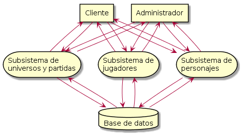

### Diagramas funcionales de los subsistemas

### Esquemas externos del subsistema de Jugadores

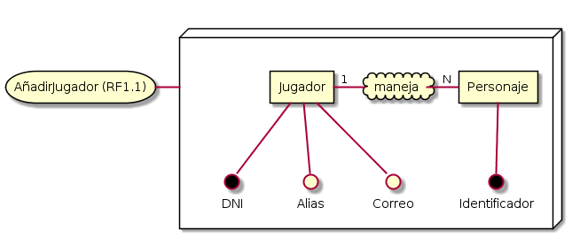

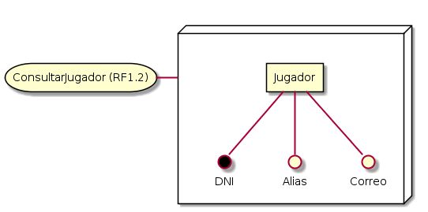

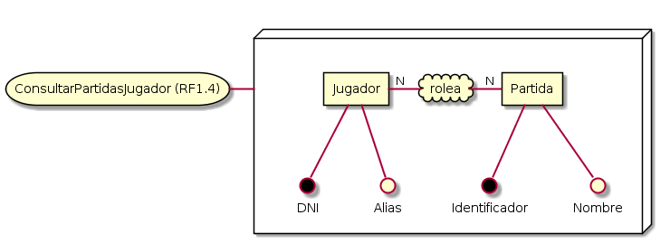

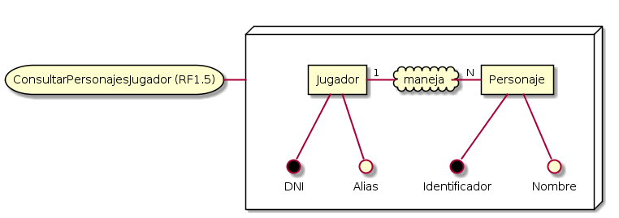

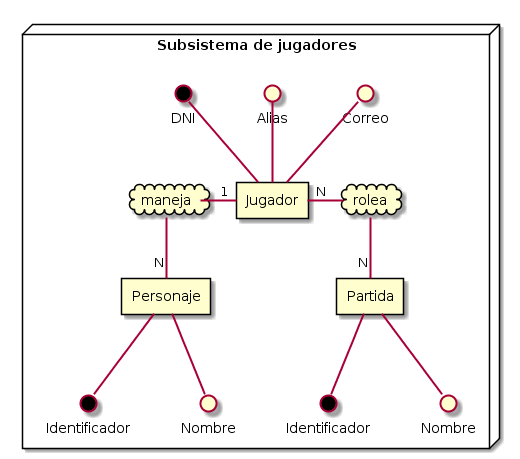

### Esquemas externos del subsistema de Personajes

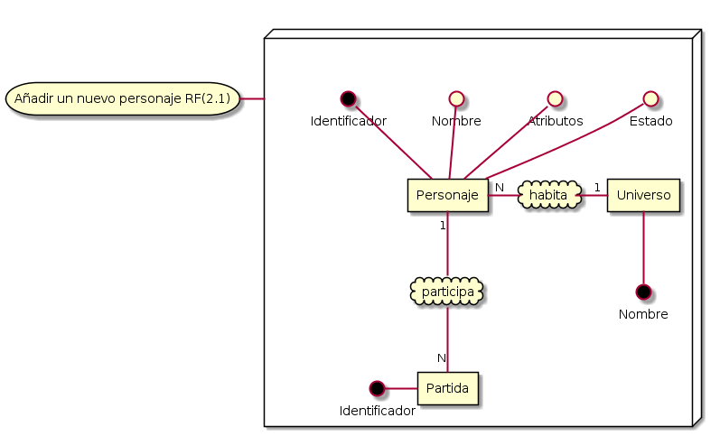

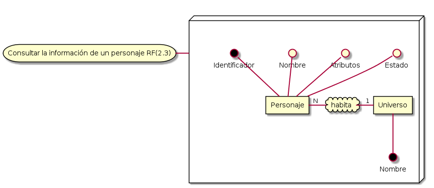

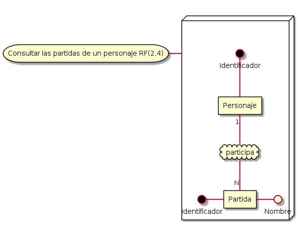

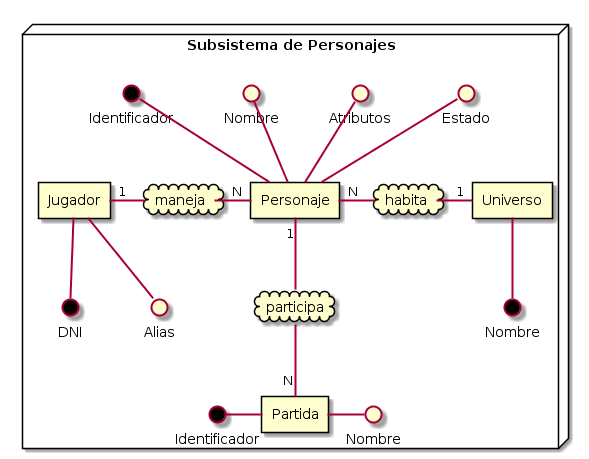

### Esquemas externos del subsistema de Universos y Partidas

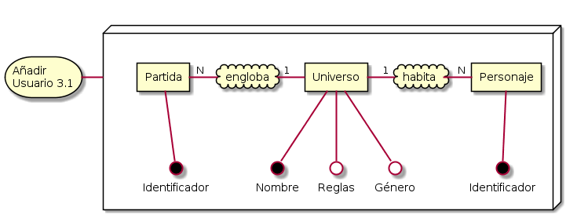

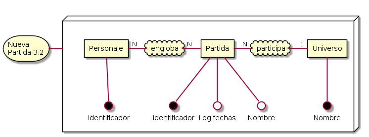

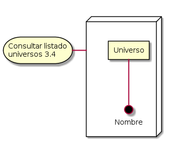

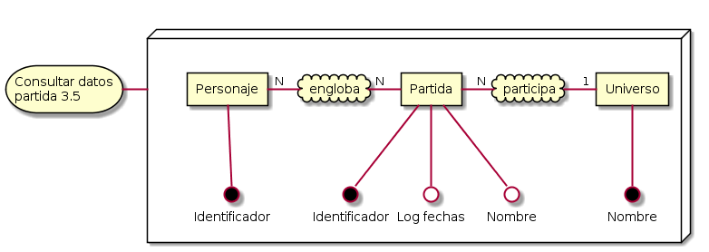

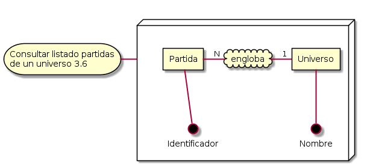

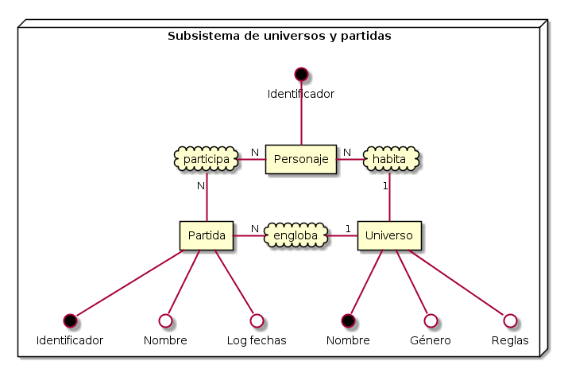

### Esquema entidad-relación del sistema completo

Al tener unicamente un contenedor su diagrama externo es exactamente el mismo
que el diagrama externo del sistema completo. Esto es, el diagrama
entidad-relación.

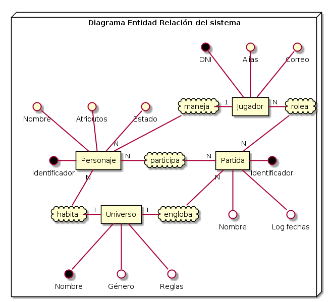

## Diseño

### Diseño Lógico

### Diseño Físico

~~~
CREATE TABLE Universo (
  nombre    VARCHAR2(32) PRIMARY KEY,
  genero    VARCHAR2(32),
  reglas    VARCHAR2(32)
);

CREATE TABLE Jugador (
  dni             VARCHAR2(9) PRIMARY KEY,
  alias           VARCHAR2(32),
  correo          VARCHAR2(32) UNIQUE
);

CREATE TABLE Personaje (
  identificador   NUMBER PRIMARY KEY,
  nombre          VARCHAR2(32) NOT NULL,
  atributos       VARCHAR2(32),
  estado          BIT,
  jug_id          NUMBER FOREIGN KEY REFERENCES Jugador(dni)
  uni_id          VARCHAR2(32) FOREIGN KEY REFERENCES Universo(nombre)
);

CREATE TABLE Partida (
  identificador   NUMBER PRIMARY KEY,
  nombre          VARCHAR2(32) NOT NULL,
  log_fechas      VARCHAR2(32),
  uni_nombre      VARCHAR2(32) FOREIGN KEY REFERENCES Universo(nombre)
);

CREATE TABLE Rolea (
  jug_id    NUMBER FOREIGN KEY REFERENCES Jugador(dni),
  par_id    NUMBER FOREIGN KEY REFERENCES Partida(identificador),
  CONSTRAINT PK_Rolea PRIMARY KEY (jug_id, par_id)
);

CREATE TABLE Participa (
  per_id    NUMBER FOREIGN KEY REFERENCES Personaje(identificador),
  par_id    NUMBER FOREIGN KEY REFERENCES Partida(identificador),
  CONSTRAINT PK_Participa PRIMARY KEY (per_id, par_id)
);

~~~

### Disparadores

Disparador hecho por Jose, asociado a la restricción semántica **RS1.2**,
comprueba que el DNI no esté asociado a otro jugador.

~~~
CREATE TRIGGER dni_valido
BEFORE INSERT OR UPDATE ON Jugador
DECLARE

  dni_no_valido EXCEPTION;
  PRAGMA EXCEPTION_INIT (dni_no_valido, -1);

BEGIN
  IF EXISTS (SELECT *
           FROM Jugador AS j
           WHERE j.dni = :new.dni
          )
  THEN
    RAISE dni_no_valido;
  END IF;

  EXCEPTION
    WHEN dni_no_valido THEN
      DBMS_OUTPUT.PUT_LINE("Error: Ya hay un cliente con ese DNI en el sistema");
      RAISE DUP_VAL_ON_INDEX;
  END;

END;
~~~

Disparador hecho por Laura, asociado a la restricción semántica **RS2.2**,
comprueba que el universo que queremos asociarle a nuestro personaje realmente existe.

~~~
CREATE OR REPLACE TRIGGER ComprobarExistenciaUniverso
BEFORE INSERT OR UPDATE ON Personaje

DECLARE
  nombreNoExistente EXCEPTION;

BEGIN
  IF NOT EXISTS (SELECT *
              FROM Universo AS uni
              WHERE uni.nombre = :new.uni_id)
  THEN
    RAISE nombreNoExistente;
  END IF;

  EXCEPTION
  WHEN nombreNoExistente THEN
    DBMS_OUTPUT.PUT_LINE("Error: No existe dicho universo.");
    RAISE DUP_VAL_ON_INDEX;
  END;
END;
~~~

Disparador hecho por Miguel, asociado a la restricción semántica **RS3.2**, comprueba que el nombre del universo no este ya registrado.

~~~
CREATE OR REPLACE TRIGGER checkUniversoNombre
BEFORE INSERT OR UPDATE ON Universo

DECLARE
  nombreYaExistente EXCEPTION;

BEGIN
  IF EXISTS (SELECT * FROM Universo as uni WHERE uni.nombre = :new.nombre) THEN
    RAISE nombreYaExistente;
  END IF;

  EXCEPTION
  WHEN nombreYaExistente THEN
    DBMS_OUTPUT.PUT_LINE("Error: ya existe un universo con ese nombre.");
    RAISE DUP_VAL_ON_INDEX;
  WHEN OTHERS THEN
    DMBS_OUTPUT.PUT_LINE("Error de algún tipo");
    RAISE;
  END;
END;
~~~
